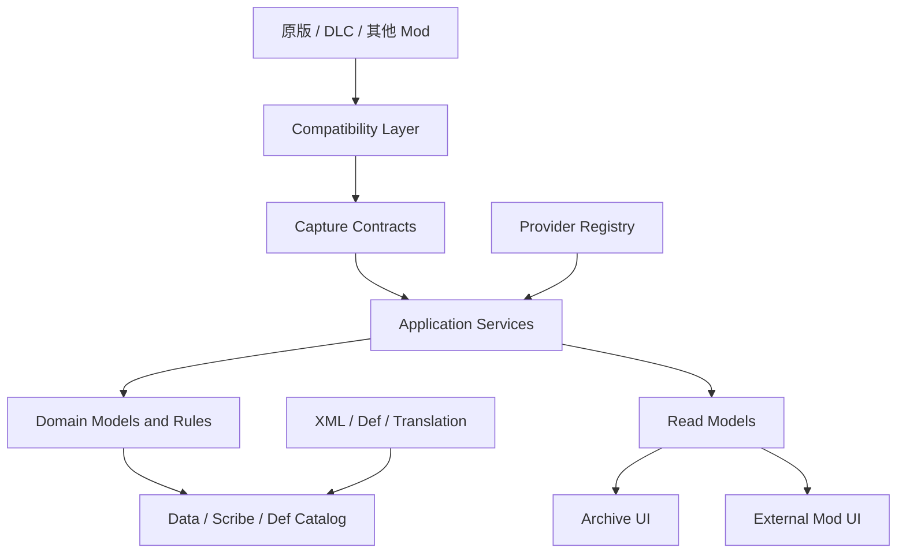

# PersonalChronicle 高拓展 / 高接入型 Mod 架构方案

> 目标版本：4.0 基线，面向 4.1～5.0 演进
>
> 文档定位：PersonalChronicle 的长期开放平台方案，而不是某一个 UI 功能的实现说明。
>
> 核心目标：让其他 mod 可以低成本接入档案、事件、工时、生产、关系和 UI 数据，同时不需要修改 PersonalChronicle 内部类、不需要复制存档逻辑，也不需要依赖具体 UI 实现。

---

## 1. 定位与边界

PersonalChronicle 不应只是一个“记录几个事件的档案窗口”，而应定位为：

> 殖民地历史数据的统一接入层、持久化层和只读查询层。

它负责四件事：

1. 接收来自原版和其他 mod 的结构化历史数据。
2. 以稳定身份、语言无关的形式持久化数据。
3. 提供统一的查询服务和只读视图模型。
4. 将数据渲染为档案馆 UI、时间轴、关系网和统计摘要。

它不负责：

- 接管其他 mod 的业务规则。
- 修改其他 mod 的 Def、存档或内部状态。
- 要求接入方直接调用 `ArchiveMainTabWindow`。
- 将本 mod 的 UI 布局作为其他 mod 的强制依赖。
- 把第三方 mod 的 DefName、类型名和数值阈值散落到核心代码。

### 1.1 设计结果

其他 mod 的接入应至少有三种方式：

| 接入层级 | 适用对象 | 是否需要 C# | 是否依赖内部实现 |
|---|---|---:|---:|
| XML / Def | 新事件类型、档位、分类、翻译、显示规则 | 否 | 否 |
| 公共契约 API | 工时、事件、生产、关系等运行时数据 | 是 | 否 |
| 兼容适配器 | 第三方 mod 的特殊对象或事件 | 是 | 否，适配器隔离依赖 |

默认推荐顺序为：

```text
XML/Def → 公共接口 → Provider/Adapter → Harmony
```

只有前面的扩展点无法满足需求时，才允许进入下一级。

---

## 2. 当前 4.0 基线评估

当前代码已经具备成为开放平台的基础：

| 已有能力 | 当前实现 | 评价 |
|---|---|---|
| 统一档案服务 | `IArchiveService` / `ArchiveService` | 功能完整，但历史接口较宽，后续不再继续膨胀 |
| 稳定人物身份 | `Pawn.GetUniqueLoadID()` | 可作为跨存档稳定键，继续保留 |
| 运行时数据组件 | `ChronicleGameComponent` | 适合统一处理存档、采样、缓存失效 |
| Def 驱动事件 | `ChronicleEventDef` / `Chronicle_Events.xml` | 适合扩展事件类型和重要等级 |
| 工时采集 | `IWorkTimeCaptureService` | 已具备外部工作系统接入能力 |
| 工时评价 | `IWorkIntensityService` / `IWorkIntensityProvider` | 已具备 Provider 模式，但还需要统一到总 API 门面 |
| 只读视图 | `WorkIntensityView`、`ProductionSummaryView` 等 | 方向正确，应继续禁止外部直接读存档实体 |
| 动态刷新 | `DataRevision` + `[Unsaved]` 缓存 | 可作为所有查询缓存的统一失效机制 |
| 捕获补丁 | `Source/PersonalChronicle/Capture` | 应继续保持“轻补丁、重服务” |

当前主要结构性问题：

1. `IArchiveService` 同时包含查询、捕获和原版 `Pawn/Thing` 参数，已经偏宽，不适合继续作为唯一公共接口。
2. 公共入口以 `PersonalChronicleMod` 静态属性分散暴露，接入方需要知道多个服务字段。
3. 当前只有工时 Provider，事件、生产、关系还没有统一的外部写入契约。
4. 部分历史 API 为兼容旧版本而保留，不能直接删除，但也不应继续扩展。
5. UI 目前主要消费本 mod 自己的 View，未来需要明确“数据扩展”和“UI 扩展”的边界。

### 2.1 兼容原则

`IArchiveService` 现有方法属于 Legacy Surface：

- 保留已有签名。
- 不再向其中追加新的业务能力。
- 新功能进入独立的 `IXXXService`。
- 未来通过统一 API 门面暴露这些独立服务。
- 旧 API 只作为兼容桥，不作为新接入文档的首选入口。

这样可以避免一个巨型接口继续膨胀，也避免旧接入方因新增功能而重新编译或修改。

---

## 3. 目标架构



### 3.1 分层职责

#### A. Public Contracts 层

对外最稳定，定义接口、DTO、枚举、错误码和版本信息。

要求：

- 不暴露 `PawnObject`、`ChronicleGameComponent`、内部 Dictionary。
- 不让外部 mod 依赖 UI 类型。
- 新增能力采用新增接口，不修改已有接口语义。
- 参数使用强类型 DTO，不使用 `Dictionary<string, object>`。

#### B. Compatibility 层

唯一允许感知外部 mod、DLC 或 Harmony 目标细节的区域。

职责：

- 检测可选 mod 是否存在。
- 将第三方对象转换成 PersonalChronicle 契约。
- 保存第三方类型名、DefName 和版本差异。
- 在依赖缺失时返回“不支持”或降级结果。

核心 Domain/Application 不得出现第三方命名空间引用，也不得散落 DLC 判断。

#### C. Capture 层

负责“观察”和“上报”，不负责复杂业务规则。

组成：

- 原版事件捕获。
- `GameComponent` 周期采样。
- Harmony Postfix 捕获无法通过原生扩展点获取的行为。
- 外部 mod 通过公共 Capture API 主动上报。

捕获层只生成结构化输入，统一交给 Application Service；不得直接修改存档字典。

#### D. Application 层

负责用例编排、校验、去重、路由、缓存失效和服务注册。

不负责：

- UI 绘制。
- 具体第三方识别。
- 依赖某个界面的布局。

#### E. Domain 层

负责稳定的业务规则：

- 事件重要等级。
- 稳定身份和对象关系。
- 工时强度计算。
- 记录生命周期。
- 去重键语义。

Domain 不读取 UI、不访问 `Find.WindowStack`，不保存翻译后的文案。

#### F. Data / Def 层

负责：

- `GameComponent`、`IExposable` 和 Scribe。
- Def 目录读取。
- 数据迁移。
- 运行时缓存重建。

缓存只能是派生结果，不能成为事实数据源。

#### G. Read Model / UI 层

UI 只消费只读 View，不直接访问 Pawn、ArchiveObject 或内部存档集合。

未来其他 mod 若需要展示档案数据，也应消费 Read Model，而不是继承或 Patch `ArchiveMainTabWindow`。

---

## 4. 公共 API 设计

### 4.1 统一 API 门面

4.0 继续保留当前静态属性以兼容旧接入；4.1 新增统一门面：

```csharp
public interface IPersonalChronicleApi
{
    ApiVersion Version { get; }
    IArchiveQueryService Queries { get; }
    IArchiveEventSink Events { get; }
    IWorkTimeCaptureService WorkTime { get; }
    IWorkIntensityService WorkIntensity { get; }
    IArchiveProviderRegistry Providers { get; }
}
```

建议入口：

```csharp
public static class PersonalChronicleApi
{
    public static bool TryGet(out IPersonalChronicleApi api);
}
```

接入方只需要寻找一个入口，不需要了解 `ArchiveService` 的具体实现，也不需要同时判断多个静态服务属性。

### 4.2 服务拆分

#### `IArchiveQueryService`

只读查询：

- 按稳定 ID 查询对象摘要。
- 查询人物身份、角色、当前状态。
- 查询事件、时间轴和关联对象。
- 查询生产、战斗、社会关系、工时 View。
- 返回只读快照。

#### `IArchiveEventSink`

统一事件写入口：

```csharp
public interface IArchiveEventSink
{
    CaptureResult TryRecord(ArchiveEventInput input);
}
```

#### `IWorkTimeCaptureService`

当前 4.0 已有的契约继续保留，用于自定义工作系统写入采样。

#### `IWorkIntensityService`

当前 4.0 已有的契约继续保留，用于读取强度、梯度、殖民地工种排行和工时聚合。

#### 专用 Provider

建议按能力拆分，不建立一个包含所有回调的 God Interface：

- `IArchiveEventProvider`
- `IProductionProvider`
- `ISocialRelationProvider`
- `ICombatRecordProvider`
- `IWorkIntensityProvider`
- `IArchiveUiDataProvider`

一个 Provider 只负责一个领域，外部 mod 可以只实现自己需要的接口。

---

## 5. 事件接入契约

工时只是第一类外部数据。为了让战斗、生产、关系和任务 mod 低成本接入，需要统一的事件输入模型。

### 5.1 事件输入模型

```csharp
public sealed class ArchiveEventInput
{
    public string SourceId;
    public string EventTypeDefName;
    public long Tick;
    public ChronicleImportance Importance;
    public ArchiveEntityRef Primary;
    public IReadOnlyList<ArchiveEntityRef> Subjects;
    public IReadOnlyDictionary<string, string> Parameters;
    public string DeduplicationKey;
}
```

字段规则：

| 字段 | 规则 |
|---|---|
| `SourceId` | 接入 mod 的稳定标识，例如 `MyMod.Combat` |
| `EventTypeDefName` | 指向事件 Def，不保存本地化文本 |
| `Tick` | 由捕获方提供，缺省时由服务使用当前游戏 Tick |
| `Importance` | 可显式指定；缺省则由事件 Def 计算 |
| `Primary` | 事件的主要对象，使用稳定 ID |
| `Subjects` | 参与者、武器、地点等关联对象 |
| `Parameters` | 语言无关参数，限制长度和数量 |
| `DeduplicationKey` | 可选，防止多个补丁重复上报同一事件 |

### 5.2 事件 Def

新事件优先通过 XML 增加 Def：

```xml
<PersonalChronicle.Domain.ChronicleEventDef>
  <defName>MyModEventResearchBreakthrough</defName>
  <kind>Other</kind>
  <defaultImportance>2</defaultImportance>
  <labelKey>MyMod.UI.Event.ResearchBreakthrough</labelKey>
</PersonalChronicle.Domain.ChronicleEventDef>
```

接入方不应在 C# 中重复定义事件名称、重要等级或 UI 文案。

### 5.3 去重和幂等

同一行为可能同时被原版回调、Harmony 补丁和其他 mod 捕获，因此写入口必须支持幂等：

```text
DeduplicationKey = SourceId + ":" + StableObjectId + ":" + EventType + ":" + Tick
```

这只是推荐结构，具体格式由事件源决定。服务层应：

- 在同一游戏 Tick 内拒绝完全相同的重复写入。
- 不把去重缓存作为永久事实数据。
- 存档后重新加载时，仍以持久化事件为事实来源。

---

## 6. 数据模型与生命周期

### 6.1 稳定身份

所有可跨存档查询的实体都使用稳定 ID：

- Pawn：`pawn.GetUniqueLoadID()`。
- Thing：使用本 mod 现有的 `defName:thingIDNumber` 约定，并明确它只适用于当前游戏生命周期。
- 外部实体：由接入方提供 `SourceId + LocalId` 组合键。

禁止使用：

- `GetHashCode()` 作为持久键。
- 运行时对象引用作为持久键。
- 翻译后的名字作为持久键。

### 6.2 存档数据和缓存分离

| 类型 | 示例 | 处理方式 |
|---|---|---|
| 配置 | 强度档位、事件 Def、显示顺序 | XML / Def，只读 |
| 存档事实 | 事件、人物快照、工时累计、关系快照 | Scribe 持久化 |
| 派生缓存 | 殖民地排行、时间轴索引、UI 聚合 | `[Unsaved]`，可重建 |
| 临时状态 | 当前窗口滚动位置、过滤条件 | 窗口字段，不进存档 |

读档流程必须能够在缓存全部丢失时，从 `ChronicleGameComponent` 和 Def 重新构建完整查询结果。

### 6.3 版本分离

需要同时维护两种版本：

1. **API Contract Version**：对外接口兼容性，例如 `4.x`。
2. **Save Schema Version**：存档字段和迁移版本，例如 `SchemaVersion = 4`。

API 版本升级不应自动等于存档迁移；存档迁移也不应修改公共接口语义。

---

## 7. Provider 与注册表规范

### 7.1 Provider 最小契约

```csharp
public interface IArchiveProvider
{
    string ProviderId { get; }
    string ContractVersion { get; }
    int Priority { get; }
    IReadOnlyCollection<string> Capabilities { get; }
}
```

具体领域 Provider 在此基础上扩展能力，不把所有方法放入基接口。

### 7.2 注册规则

- `ProviderId` 必须稳定且全局唯一。
- 同一 `ProviderId` 重复注册时，后注册者替换前者并记录原因。
- 按 `Priority` 从高到低调用。
- Provider 异常不能阻断原版捕获和内置 Provider。
- 同一 Provider 连续失败时启用熔断，避免每次查询都重复抛错。
- Provider 注册表是进程级运行时对象，不写入存档。
- 读档、重开游戏后重新注册。

### 7.3 Provider 不应做的事

- 直接修改 `ChronicleGameComponent.Objects`。
- 直接操作 `PawnObject.WorkTime` 的内部字典。
- 在 `TryEvaluate` 内写存档。
- 在每 Tick 内创建大量集合。
- 依赖某一个 UI 窗口已经打开。

### 7.4 接入时机

推荐由接入方在自己的初始化回调中注册：

```csharp
if (PersonalChronicleMod.RegisterWorkIntensityProvider(provider))
{
    // 注册成功；不要在这里访问游戏存档对象。
}
```

更长期的统一入口是 `PersonalChronicleApi.TryGet`。Def 解析相关逻辑不要放在过早的静态构造阶段，应在 DefDatabase 完成后再解析。

---

## 8. XML / Def 接入标准

### 8.1 适合 XML 的内容

- 事件类型。
- 档案分类。
- 重要等级默认值。
- 工时强度阈值和颜色。
- 翻译键。
- 数据过滤和显示顺序。

### 8.2 XML Patch 原则

- 新增内容优先 `PatchOperationAdd`。
- 只有明确需要覆盖默认值时才 Patch 原 Def。
- 不覆盖整个 Def，避免抹掉其他 mod 的字段。
- 所有自有 DefName 带自己的前缀。
- 新增翻译键必须同时提供英文和简体中文回退文本。

### 8.3 Def 删除和重命名

已发布的 DefName 是存档身份的一部分，不应直接重命名或删除。

如果必须更名：

1. 保留旧 DefName 作为兼容别名。
2. 在读取或迁移阶段将旧 key 映射到新 key。
3. 至少跨一个主版本后，才考虑清理兼容别名。

---

## 9. UI 扩展策略

### 9.1 核心原则

其他 mod 不应 Patch `ArchiveMainTabWindow` 来插入内容。这样会产生：

- UI 版本强耦合。
- 多 mod Patch 顺序冲突。
- 字体、滚动区和布局变化后全部失效。

推荐路径：

```text
外部 Mod 数据 Provider
        ↓
Read Model / Archive Section DTO
        ↓
PersonalChronicle 统一 Renderer
```

### 9.2 计划中的 UI Section 契约

4.1 可新增只读 Section 数据模型：

```csharp
public interface IArchiveUiDataProvider
{
    string SectionId { get; }
    IReadOnlyCollection<string> SupportedTabs { get; }
    ArchiveSectionSnapshot BuildSection(ArchiveUiContext context);
}
```

`ArchiveSectionSnapshot` 只描述：

- 标题翻译键。
- 副标题翻译键。
- 指标值。
- 标签。
- 进度比例。
- 可跳转的稳定对象 ID。
- 数据状态（正常、样本不足、不可用）。

它不允许外部 Provider 返回 `Rect`、`GUIStyle` 或自定义绘制回调。这样 UI 仍由 PersonalChronicle 统一控制，避免外部 mod 把布局绘制逻辑带入档案馆。

### 9.3 UI 接入的降级行为

- Provider 不存在：隐藏该 Section，不显示空白错误。
- Provider 返回空数据：显示统一的“暂无数据”状态。
- Provider 抛异常：记录一次警告，当前 Section 降级隐藏。
- 窗口尺寸变化：由核心 Renderer 负责滚动和裁剪。
- 语言变化：只使用翻译键重新渲染，不持久化显示文本。

---

## 10. 第三方 Mod 与 DLC 兼容层

### 10.1 可选依赖

第三方 mod 接入必须是可选的：

- `About.xml` 只在确有必要时声明 Required Dependency。
- 普通数据接入优先使用 Soft Dependency。
- 检测逻辑集中在 `Compatibility/ModDetection`。
- 未检测到目标 mod 时，不影响 PersonalChronicle 基础功能。

### 10.2 适配器模板

```text
Compatibility/
├── ModDetectionService.cs
├── OptionalModA/
│   ├── ModADetection.cs
│   └── ModAArchiveAdapter.cs
└── Dlc/
    ├── DlcStatus.cs
    └── BiotechAdapter.cs
```

适配器内部可以使用反射或第三方类型，但必须满足：

- 探测结果缓存，不在热路径反射。
- 目标类型不存在时返回 `false` 或空结果。
- 适配器异常被隔离并记录上下文。
- 核心层不出现第三方命名空间。

### 10.3 Harmony 使用边界

Harmony 仅用于无法通过 XML、Comp、GameComponent、原生事件或公开 API 获取的捕获点。

每个 Patch 必须附带记录：

- Target。
- Patch 类型。
- 使用原因。
- 已排除的原生替代方案。
- 兼容性风险。
- 执行顺序。
- 失败行为。

补丁方法只做捕获和转发，复杂逻辑进入 Application Service；优先 Postfix，禁止为了方便使用 Prefix 改写原版流程。

---

## 11. 性能与可靠性预算

### 11.1 热路径

每 Tick 或高频回调中：

- 不使用 LINQ。
- 不创建大量临时集合。
- 不访问 UI。
- 不做 Def 全库扫描。
- 不做反射。
- 不直接重建时间轴和关系网。

高频采样应使用固定周期、轻量计数和批量失效。当前工时采样使用 `GameComponent`，查询聚合使用带 `DataRevision` 的缓存，后续其他领域沿用同一模式。

### 11.2 输入保护

公共写入口必须校验：

- 稳定 ID 非空。
- 事件类型存在或明确允许未知类型暂存。
- Tick 非负或可回退到当前 Tick。
- 参数数量和长度有限制。
- 单次写入不能超过合理的集合容量。
- 外部调用不能写入已归档人物的实时工时。

### 11.3 失败隔离

接入失败不能影响核心档案：

```text
外部 Provider 失败
    ↓
记录一次结构化 Warning
    ↓
当前能力降级
    ↓
内置 Provider / 空结果继续运行
```

禁止空 `catch`。所有异常必须包含 ProviderId、能力名和操作上下文。

---

## 12. API 版本与发布规则

### 12.1 版本策略

采用语义化版本：

- Major：删除接口、改变字段含义、改变存档语义。
- Minor：新增接口、新增字段、新增 Def，不破坏已有调用。
- Patch：修复错误、性能和兼容性，不改变契约含义。

### 12.2 接口规则

- 已发布接口不改参数顺序和返回类型。
- 新能力新建接口，不向旧巨型接口继续追加方法。
- 弃用接口保留至少一个 Minor 周期。
- 弃用时提供迁移说明和兼容包装器。
- 枚举只能追加值，不能重新排序已有值。
- 字符串 key 一旦写入存档，必须建立别名或迁移表后才能替换。

### 12.3 能力探测

接入方不要用 DLL 文件版本猜功能是否存在，应使用能力探测：

```csharp
if (api.Version.Supports("archive.events.v1"))
{
    // 使用事件写入口
}
```

如果未来需要拆分 `PersonalChronicle.Contracts.dll`，该程序集应保持：

- 不引用 UI。
- 不引用第三方 mod。
- 尽量不引用 Verse/RimWorld。
- 只包含接口、DTO、枚举和版本信息。

4.0 暂不强制拆分程序集，先通过主 DLL 内的稳定 Namespace 和新增契约完成兼容；待接口稳定后再评估独立 Contracts DLL。

---

## 13. 推荐目录结构

```text
Source/PersonalChronicle/
├── Api/
│   ├── IPersonalChronicleApi.cs
│   ├── ApiVersion.cs
│   └── Contracts/
├── Application/
│   ├── ArchiveService.cs
│   ├── Capture/
│   ├── Queries/
│   └── Providers/
├── Compatibility/
│   ├── ModDetection/
│   ├── Dlc/
│   └── Adapters/
├── Capture/
│   ├── Harmony/
│   ├── Native/
│   └── External/
├── Data/
│   ├── ChronicleGameComponent.cs
│   ├── DefCatalog/
│   └── Migration/
├── Domain/
│   ├── Events/
│   ├── Identity/
│   ├── Career/
│   └── Relations/
└── Archive/
    ├── ReadModels/
    ├── Renderers/
    └── ArchiveMainTabWindow.cs
```

当前目录不必一次性重排。推荐采用“新增接口 → 迁移调用方 → 标记旧入口 → 再拆目录”的渐进路线，避免一次大爆炸重构。

---

## 14. 接入方开发体验

仓库应提供以下接入材料：

1. `docs/高拓展高接入架构方案.md`：总架构和边界。
2. `docs/WorkIntensityIntegration.md`：工时 Provider 和采样示例。
3. `docs/ApiReference.md`：公共接口、字段语义、版本信息。
4. `docs/CompatibilityGuide.md`：Soft Dependency、Adapter、Harmony 规则。
5. `Examples/PersonalChronicle.IntegrationExample/`：可复制的最小接入 mod。
6. `CHANGELOG.md`：每个公共接口和存档字段的变更记录。

最小接入流程应控制在以下步骤内：

```text
1. 添加 XML Def / 翻译键
2. 引用公共接口
3. 在初始化回调注册 Provider
4. 通过 Service 写入或读取数据
5. 不访问 PersonalChronicle 内部类
```

如果接入方必须阅读 `ChronicleGameComponent` 或反射 `ArchiveMainTabWindow`，说明公共契约缺失，应优先补契约，而不是要求接入方继续绕过封装。

---

## 15. 分阶段实施路线

### Phase 0：4.0 基线固化

当前已具备或应立即固化：

- 保留 `IArchiveService` 旧接口。
- 保留并文档化 `IWorkTimeCaptureService`。
- 保留并文档化 `IWorkIntensityService` / `IWorkIntensityProvider`。
- 所有新数据使用稳定 ID和语言无关 key。
- Def、翻译、缓存和数据采样边界写入文档。
- 不再继续向 `IArchiveService` 添加新方法。

### Phase 1：4.1 公共门面和事件写入口

优先级最高：

1. 新增 `IPersonalChronicleApi`。
2. 新增 `IArchiveQueryService`，把只读查询从 Legacy Service 中抽出。
3. 新增 `IArchiveEventSink` 和 `ArchiveEventInput`。
4. 加入事件去重、输入限制和统一 `CaptureResult`。
5. 将原有 `OnKillRecorded`、`OnRelationChanged` 等写入口逐步包装到统一事件契约。

### Phase 2：4.2 领域 Provider 完善

新增：

- 生产 Provider。
- 战斗 Provider。
- 社会关系 Provider。
- 地点/旅行 Provider。
- UI Section Provider 的只读数据模型。

每个 Provider 独立注册、独立异常隔离、独立版本能力声明。

### Phase 3：4.3 接入工具包

- 最小示例 mod。
- 自动生成接入模板。
- API 参考页。
- 运行时诊断窗口：显示已注册 Provider、版本、能力和最近一次失败。
- 集成测试存档和自动化检查。

### Phase 4：5.0 可选 Contracts 程序集

只有在 4.x 接口稳定后再评估：

- 将纯接口和 DTO 拆到 `PersonalChronicle.Contracts.dll`。
- 主 mod 只实现 Contracts。
- 接入方引用 Contracts 而不是实现程序集。
- 若拆分会带来 RimWorld 装载风险，则保留单 DLL，不为“形式上的解耦”牺牲稳定性。

---

## 16. 验收标准

> **落地进度（截至 2026-08-09，v4.3）**：Phase 1（统一 API 门面 + 事件写入口）、Phase 2（领域 Provider 完善 + Read Model 契约）与 UI 收口（§7.4 Read Model 隔离深化）均已落地并通过编译/校验。
> **Phase 2 新增**：`Api/IArchiveProviderRegistry` + `ArchiveProviderRegistry`（统一注册表，含失败隔离遍历）；四个领域 Provider 契约 `Api/DomainProviders/*`（IProductionProvider / IBattleProvider / IRelationProvider / IPlaceProvider）及其输入/输出模型与 Builtin 实现；`Archive/ReadModels/*`（ArchiveSectionSnapshot 基类、IArchiveUiDataProvider 契约、Home/Overview/Detail/Event 四个 Section 快照、ArchiveUiDataProvider 默认实现）。
> `IPersonalChronicleApi.Providers` 升级为统一的 `IArchiveProviderRegistry`（并保留兼容的 `WorkIntensityProviders`）；`ChronicleMod` 在初始化时创建统一注册表并注册全部内置领域 Provider。
> **UI 收口（v4.3）**：`ArchiveMainTabWindow.RefreshNow` 完全通过 `IArchiveUiDataProvider` 获取 Home/Overview/Detail 快照；RebuildPawnCounts/RebuildRecentLines/RebuildImportantCards/RebuildDetailCache 不再直读 `IArchiveService` 的查询/排序/null-guard（删除旧的 CollectCandidates 死代码），仅做快照→已有缓存字段的格式化映射。绘制路径中的按需交互查询（GetLivePawn/GetLiveLocation/GetCurrentHolder 等）属运行时查询，保持现状。
> 校验：`dotnet build -c Release` 0 错 0 警。

### 架构

- [x] Domain 不引用 UI/Application。
- [x] Core 不引用第三方 mod 类型。
- [x] 新能力不再追加到 `IArchiveService`（只读查询抽到 `IArchiveQueryService`，写入抽到 `IArchiveEventSink`）。
- [x] Provider 只能通过注册表和接口通信。
- [x] 统一 Provider 注册表（IArchiveProviderRegistry）聚合所有领域 Provider，按优先级排序、失败隔离遍历。
- [x] UI 通过 IArchiveUiDataProvider（Read Model 门面）获取 Section 级只读快照，Home/Overview/Detail 区块的查询+排序+null-guard 已全部收口到 Read Model；窗口仅做格式化映射，不再直读 IArchiveService 编排查询。

### 接入

- [x] 领域 Provider 完善：生产 / 战斗 / 社会关系 / 地点 四领域均有独立契约（IProductionProvider / IBattleProvider / IRelationProvider / IPlaceProvider）与内置实现，统一注册到 IArchiveProviderRegistry。
- [x] 工时、事件分别有独立契约（IWorkIntensityProvider / IArchiveEventSink）。
- [x] Provider 注册幂等，按优先级工作。
- [x] Provider 异常不会阻断核心功能（IArchiveProviderRegistry.ForEach 捕获并去重上报）。
- [x] 缺少第三方 mod 时可以正常启动和读档。

### 数据

- [x] 所有持久化身份使用稳定 ID。
- [x] 存档不保存本地化文案。
- [x] 缓存全部标记为运行时数据，并可从存档重建。
- [x] 新增字段有缺省值和迁移策略（`ChronicleEvent.SourceId` 新增、Scribe 缺省 null 安全）。
- [x] 事件写入支持去重和重要等级（`DeduplicationKey` 会话去重 + `ChronicleEventImportance.Resolve`）。

### 性能

- [x] 每 Tick 路径没有 LINQ、反射和无界分配（写入薄封装到既有 AddEvent 管线）。
- [x] 聚合查询有缓存和 `DataRevision` 失效机制。
- [x] UI 查询不触发写入或重建全量数据。
- [x] 外部 Provider 不依赖窗口是否打开。

### 发布

- [x] `dotnet build -c Release` 通过。
- [x] `validate_mod` 无新增错误。
- [x] XML、翻译键和 Def 引用全部可解析。
- [x] 旧存档可以加载，旧 API 接入方不需要修改（Legacy 静态属性与 `IArchiveService` 方法全部保留）。
- [ ] 每次公共契约变更都有 Changelog 和迁移说明（待补充 CHANGELOG）。

---

## 17. 最终决策

PersonalChronicle 的开放策略确定为：

1. **数据优先**：先接入结构化数据，再决定如何展示。
2. **接口优先**：外部 mod 只依赖契约，不依赖实现。
3. **Def 优先**：阈值、事件类型、排序和文案进入 Def/XML。
4. **适配器隔离**：第三方依赖只存在于 Compatibility 层。
5. **UI 可替换**：UI 是 Read Model 的一个消费者，不是接入入口。
6. **增量兼容**：旧接口保留，新能力独立增加，避免破坏已有接入。
7. **故障隔离**：一个 Provider 失效，不影响核心档案、存档和其他 Provider。

这套方案的重点不是让每个 mod 都能直接修改档案馆，而是让每个 mod 都能以最小成本把自己的历史数据接入统一数据层，并自动获得持久化、查询、统计、重要等级和 UI 展示能力。
